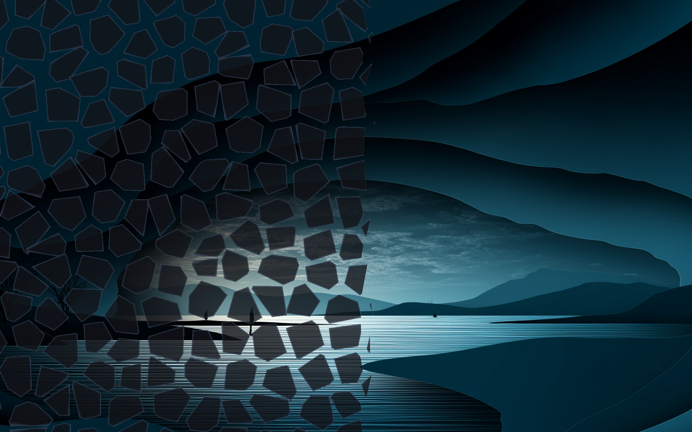

# Window FX

[English](README.md) · [Deutsch](README.de.md) · **Español** · [Français](README.fr.md) · [Italiano](README.it.md) · [Português](README.pt.md) · [Русский](README.ru.md) · [日本語](README.ja.md) · [简体中文](README.zh_CN.md)

Un plugin para [DankMaterialShell](https://github.com/AvengeMedia/DankMaterialShell) que da a las ventanas de niri sus propias animaciones al cerrarse y al abrirse: se queman, se rompen en añicos, se derriten, fallan como una señal rota o se apagan como un tubo viejo. Los bordes se iluminan en tu color de acento.



Paso a paso y con imágenes: [guía de instalación y ajustes](docs/GUIDE.es.md).

## Qué hace

niri puede dibujar una ventana que se cierra o se abre con un shader propio. El plugin escribe un shader así en `~/.config/niri/windowfx.kdl`, y niri vuelve a cargar el archivo por su cuenta en cuanto cambia. Un ajuste nuevo se nota en la siguiente ventana que se cierra o se abre.

Hay 13 tipos:

| Tipo | Qué pasa |
|---|---|
| Brasas | la ventana se quema a lo largo de un frente irregular |
| Disolver | un grano grueso desaparece en orden aleatorio |
| Pixelar | los bloques crecen y luego se desvanecen |
| Añicos | la ventana se rompe en trozos que giran y caen |
| Derretir | columnas finas se deslizan hacia abajo, cada una a su velocidad |
| Fallo de señal | desgarros, canales de color separados y bloques que saltan, y luego se deshace |
| Tubo apagado | se aplasta hasta una línea, luego hasta un punto, con un destello |
| Nieve | la imagen se ahoga en estática y se deshace grano a grano |
| Escaneo | un haz baja y deja detrás un esqueleto de líneas de los bordes |
| Lluvia de código | columnas de signos bajan, y detrás solo queda código |
| Remolino | la ventana se enrolla alrededor de su centro |
| Cuadros | los cuadros se encogen en orden aleatorio |
| Persiana | se cierran lamas horizontales |

«Aleatorio» elige un tipo nuevo para cada ventana, entre una selección que decides tú. Cerrar y abrir tienen cada uno su propia duración. Al abrir, el tipo se reproduce al revés: de forma predeterminada una ventana nueva aparece igual que desapareció la última, pero en sentido contrario. Con «Predeterminado de niri» el plugin deja esa animación a niri.

«Bordes luminosos» hace que los bordes, las grietas y las juntas se iluminen en el color de acento de DMS. Cuando cambia el acento, el plugin vuelve a escribir el archivo. Tubo apagado siempre destella en blanco, con o sin el ajuste.

Si usas el plugin [Profiles](https://github.com/satoshoe-dev/dms-profiles), escribe `windowFx` en Ajustes → Complementos → Profiles → Complementos guardados con el perfil, y cada perfil guarda sus propias animaciones.

## Requisitos

DankMaterialShell 1.6.1 o más reciente y niri 26.04 o más reciente. La versión de niri importa por la línea include de abajo: niri conoce `optional=true` desde la 26.04.

El plugin solo escribe su propio archivo. niri lo lee cuando tu configuración de niri lo incluye, así que añade esta línea al final de `~/.config/niri/config.kdl`:

```kdl
include optional=true "windowfx.kdl"
```

Al final, porque un include sobrescribe lo que va antes; así las animaciones del plugin ganan sobre las de tu configuración principal.

«Las vecinas esperan» necesita además un niri con un parche no oficial; más detalles abajo, en «Las vecinas esperan». Todo lo demás funciona con un niri normal.

## Instalación

Desde el registro de complementos:

```sh
dms plugins install windowFx
dms ipc call plugins enable windowFx
```

También aparece en DMS en Ajustes → Complementos → Explorar. Para instalarlo desde el repositorio:

```sh
git clone https://github.com/satoshoe-dev/dms-window-fx ~/.config/DankMaterialShell/plugins/WindowFx
dms ipc call plugins enable windowFx
```

Después elige una animación al cerrar en Ajustes → Complementos → Window FX. Hasta entonces, niri mantiene sus propias animaciones.

## Ajustes

Ajustes → Complementos → Window FX

| Ajuste | Predeterminado |
|---|---|
| Animación al cerrar | Predeterminado de niri |
| Duración | 600 ms |
| Las vecinas esperan | desactivado (solo con un niri que conozca `hold-layout`) |
| Animación al abrir | Como al cerrar, al revés |
| Duración al abrir | 450 ms |
| Bordes luminosos | activado |
| El modo aleatorio elige entre estos | Brasas, Añicos, Derretir, Fallo de señal, Tubo apagado, Lluvia de código |

Las dos duraciones van de 150 a 3000 ms.

## IPC

```sh
dms ipc call windowFx kind shatter   # close animation: a kind, random or default
dms ipc call windowFx open mirror    # open animation: mirror, a kind, random or default
dms ipc call windowFx status
```

Los tipos se llaman `ember`, `dissolve`, `pixel`, `shatter`, `melt`, `glitch`, `crt`, `snow`, `scan`, `code`, `swirl`, `squares` y `blinds`.

Un atajo en niri que tira los dados para las próximas ventanas:

```kdl
binds {
    Mod+Shift+W { spawn "dms" "ipc" "call" "windowFx" "kind" "random"; }
}
```

## Las vecinas esperan

Cuando se cierra una ventana, niri la saca del diseño enseguida. Las ventanas de al lado empiezan a moverse hacia el hueco al momento y se deslizan sobre la ventana que se cierra mientras su animación sigue en marcha. Con un fundido corto casi no se nota; con un borde en llamas o con añicos que caen, la vecina tapa casi todo.

Escribí un pequeño parche para niri que añade la opción `hold-layout` a `window-close`. Con ella, todo lo que pone en marcha la retirada (las vecinas que se desplazan, la vista que se mueve, las columnas que cambian de tamaño) empieza solo cuando la animación de cierre ha terminado. El parche no forma parte de niri, y el niri de tu distribución no conoce la opción. Sin un niri compilado con este parche, «Las vecinas esperan» no tiene efecto.

El plugin comprueba al arrancar si el niri instalado conoce la opción, haciendo que `niri validate` lea un archivo diminuto que la usa. Si niri la conoce, el interruptor «Las vecinas esperan» aparece en la página de ajustes; si no, queda oculto y el plugin nunca escribe la opción, porque un niri sin el parche rechazaría el archivo entero.

## Desactivarlo

Desactivar el plugin deja `windowfx.kdl` tal como está, así que las últimas animaciones se quedan. Para volver a las animaciones propias de niri, pon antes las dos animaciones en «Predeterminado de niri», o borra el archivo. Con `optional=true`, a niri no le molesta que falte el archivo.

## Traducciones

La página de ajustes está disponible en alemán, español, francés, italiano, portugués, ruso, japonés y chino simplificado, y sigue el idioma configurado en DMS. Si una traducción suena mal, se agradece un pull request.

## Nota

Escribí este plugin con ayuda de Claude (Anthropic) y probé cada cambio en mi propio escritorio niri.

## Licencia

MIT
