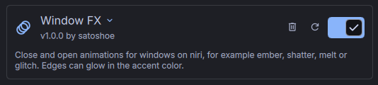
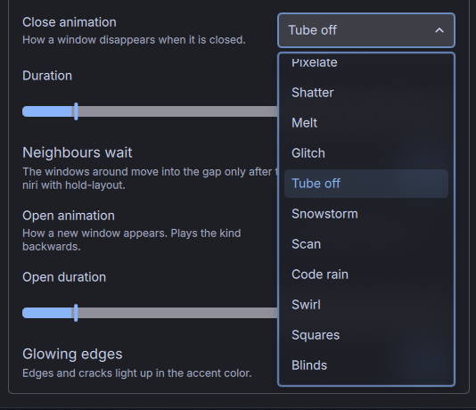
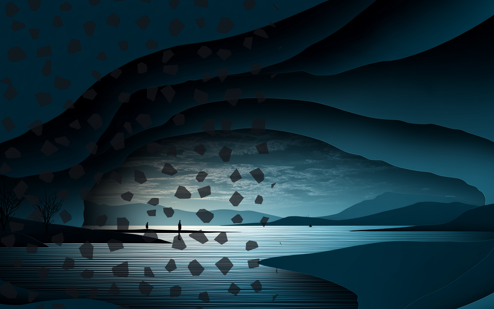
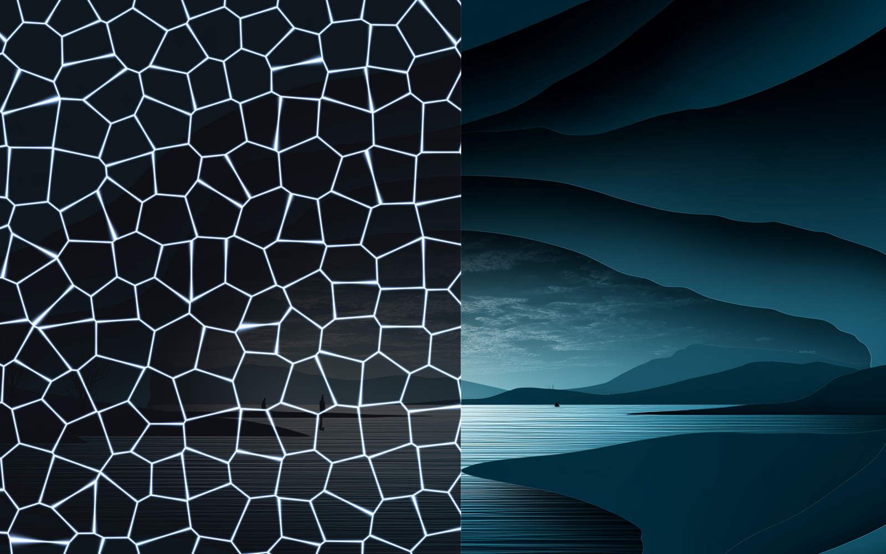
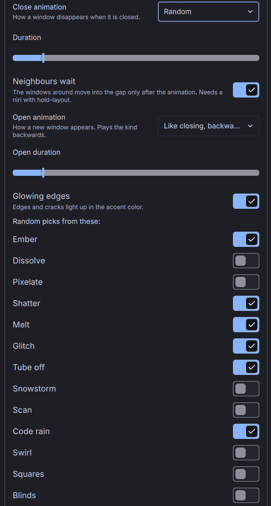

# Window FX : pas à pas

[English](GUIDE.md) · [Deutsch](GUIDE.de.md) · [Español](GUIDE.es.md) · **Français** · [Italiano](GUIDE.it.md) · [Português](GUIDE.pt.md) · [Русский](GUIDE.ru.md) · [日本語](GUIDE.ja.md) · [简体中文](GUIDE.zh_CN.md)

## 1. Installer le plugin

Clone le dépôt dans ton dossier de plugins DMS :

```sh
git clone https://github.com/21Rebel/dms-window-fx ~/.config/DankMaterialShell/plugins/WindowFx
```

## 2. L'activer

Ouvre Paramètres → Plugins. Window FX apparaît dans la liste. Active-le.



S'il n'apparaît pas, clique sur « Scan » sur cette page ou redémarre le shell avec `dms restart`.

## 3. Faire lire à niri le fichier du plugin

Le plugin écrit ses animations dans `~/.config/niri/windowfx.kdl`. niri ne lit ce fichier que si ta configuration l'inclut. Ajoute cette ligne tout à la fin de `~/.config/niri/config.kdl` :

```kdl
include optional=true "windowfx.kdl"
```

Elle va à la fin parce qu'un include remplace ce qui vient avant lui. Si ta configuration a son propre bloc `animations` avec `window-close` ou `window-open`, ce sont alors les valeurs du plugin qui l'emportent. `optional=true` évite une erreur tant que le fichier n'existe pas encore ; il faut niri 26.04 ou plus récent.

niri prend la modification en compte dès que tu enregistres le fichier.

## 4. Choisir une animation de fermeture

Déplie Window FX dans la liste des plugins. Sous « Animation de fermeture », choisis l'une des 13 animations, par exemple Éclats.



Ouvre un terminal et referme-le. La fenêtre se brise en éclats qui tournent et tombent hors du cadre.



« Durée » règle combien de temps ça prend, de 150 à 3000 ms. À 600 ms ça paraît rapide, à 1500 ms tu peux regarder.

## 5. Choisir comment les fenêtres s'ouvrent

« Animation d'ouverture » commence sur « Comme la fermeture, à l'envers » : une nouvelle fenêtre apparaît comme la dernière a disparu, jouée en sens inverse. Les braises se rassemblent, les éclats remontent et se recollent. Tant que l'animation de fermeture est sur « Par défaut de niri », cela laisse aussi l'ouverture à niri.

Tu peux aussi choisir une autre animation pour l'ouverture, « Au hasard », ou « Par défaut de niri » si tu préfères garder l'animation de niri pour les nouvelles fenêtres. « Durée d'ouverture » fonctionne comme celle de la fermeture ; 450 ms est la valeur par défaut, parce qu'une nouvelle fenêtre doit être là vite.

## 6. Bords lumineux

« Bords lumineux » fait s'allumer dans ta couleur d'accent le front du feu, les fissures entre les éclats et les jointures des carreaux. Désactive-le pour des animations sans lumière.



La couleur suit l'accent de DMS : quand l'accent change, l'animation suivante brille dans la nouvelle couleur. Tube éteint fait toujours un éclair blanc.

## 7. Laisser faire le hasard (facultatif)

Choisis « Au hasard » comme animation de fermeture. Chaque fenêtre reçoit alors sa propre animation. Sous les paramètres apparaît une liste, « Le hasard choisit parmi celles-ci : », où tu actives ou désactives chaque animation.



Six animations sont actives au départ : Braise, Éclats, Fonte, Glitch, Tube éteint et Pluie de code. Si tu les désactives toutes, c'est Braise qui sert.

## 8. Les voisines attendent (niri avec hold-layout)

Quand une fenêtre au milieu d'une rangée se ferme, niri déplace aussitôt les fenêtres à sa droite dans le vide, et elles glissent par-dessus l'animation pendant qu'elle tourne encore. Si ton niri connaît l'option `hold-layout`, la page de paramètres montre l'interrupteur « Les voisines attendent ». Activé, les voisines restent en place jusqu'à la fin de l'animation de fermeture, et ne se déplacent qu'ensuite.

Essaie sur une fenêtre qui en a une autre à sa droite ; quand la dernière fenêtre d'une rangée se ferme, rien ne vient combler le vide.

Si l'interrupteur n'apparaît pas, ton niri n'a pas l'option. Le plugin le vérifie au démarrage en faisant lire à `niri validate` un petit fichier qui l'utilise, et il n'écrit jamais l'option pour un niri qui la rejetterait.

## 9. Garder les animations par profil (facultatif)

Avec le plugin [Profiles](https://github.com/21Rebel/dms-profiles), saisis `windowFx` sous « Plugins enregistrés avec le profil ». Chaque profil garde alors ses propres animations, par exemple des calmes pour le travail et Glitch pour le soir.

## 10. Le piloter par script

```sh
dms ipc call windowFx kind melt      # close animation: a kind, random or default
dms ipc call windowFx open random    # open animation: mirror, a kind, random or default
dms ipc call windowFx status
```

Les animations s'appellent `ember`, `dissolve`, `pixel`, `shatter`, `melt`, `glitch`, `crt`, `snow`, `scan`, `code`, `swirl`, `squares` et `blinds`.

Mets-le sur une touche, dans niri :

```kdl
binds {
    Mod+Shift+W hotkey-overlay-title="Window FX: random close animation" { spawn "dms" "ipc" "call" "windowFx" "kind" "random"; }
}
```

## Dépannage

**Les fenêtres se ferment toujours comme avant.** La ligne include de l'étape 3 manque, ou « Animation de fermeture » est sur « Par défaut de niri ». `ls ~/.config/niri/windowfx.kdl` montre si le plugin a écrit son fichier.

**Mes propres animations dans config.kdl l'emportent.** La ligne include est au-dessus de ton bloc `animations`. Déplace-la à la fin du fichier.

**niri affiche une erreur de configuration qui mentionne `hold-layout`.** niri a été remplacé par un niri sans l'option, et le fichier la contient encore. Dès que DMS tourne, le plugin vérifie de nouveau et réécrit le fichier sans elle ; niri recharge de lui-même.

**« Les voisines attendent » n'apparaît pas.** Le niri installé ne connaît pas `hold-layout`. L'interrupteur apparaît au prochain démarrage de DMS une fois que c'est le cas.

**Le hasard montre toujours la même animation.** Une seule animation est active dans la liste de l'étape 7, ou aucune ; dans ce cas c'est Braise qui sert.

**Les animations restent après avoir désactivé le plugin.** Le plugin laisse `windowfx.kdl` en place. Mets les deux animations sur « Par défaut de niri » avant de le désactiver, ou supprime le fichier.
